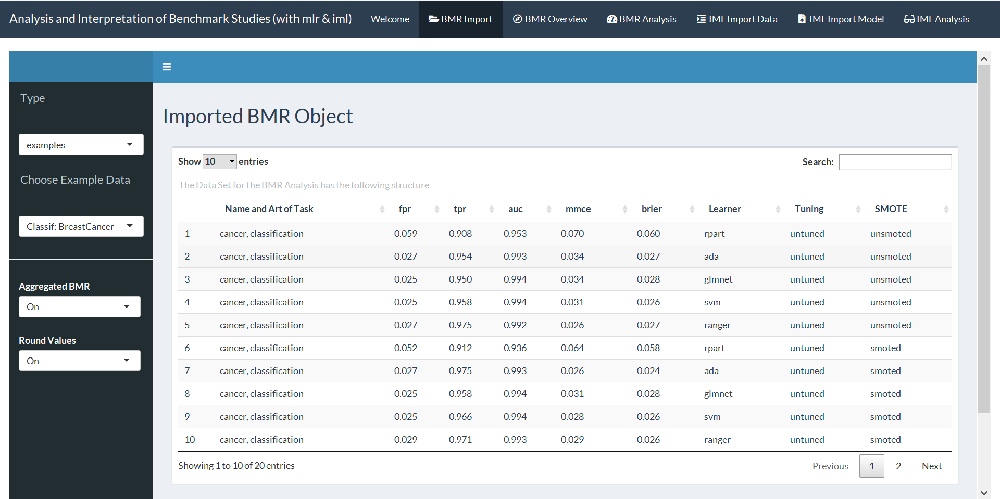
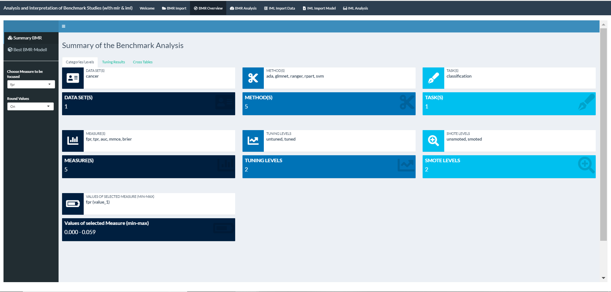
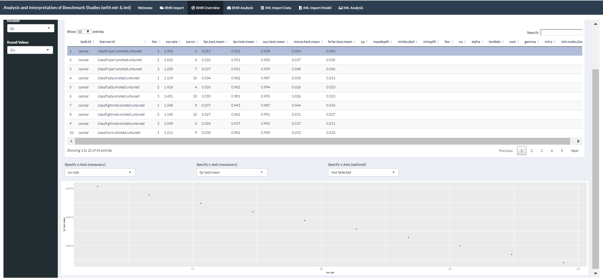
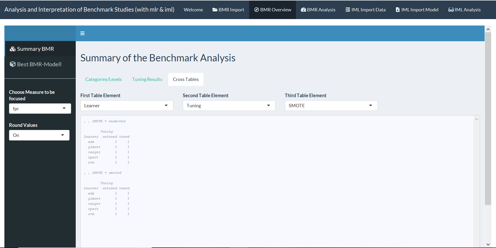

# shinyBMR: Analysis and Interpretation of Benchmark Studies (with mlr and iml)

[](https://CRAN.R-project.org/package=shinyMlr)
[](https://cran.rstudio.com/web/packages/shinyMlr/index.html)

This package should provide an interactive framework for the analysis of benchmark studies, which have been carried out based on the tools provided in [**mlr**](https://github.com/mlr-org/mlr#-machine-learning-in-r). 

As these Benchmark Studies tend to come up with a huge bandwidth of information **shinyBMR** should mainly offer a opportunity for users to get easy accessible, but highly informative overview of their enforced benchmark study based on **mlr**. This is basically done by the use of interactive, graphical tools as well as stctured and detailed summaries. 

Another point coming up when performing such analyses is the question about explainability and interperatbility. Many of the machine learning (ML) methods are so called blackbox methods, meaning there is not such an easy way - like for example in logistic regression - for calculating the output when the input/data and the focused model are provided. In this sense most of the ML methods return your results without eyplaining you the way the were ablt to come up with this output. But there is a way out of this situation: one can make use of so called model-agnostic methods provided in the [**iml**](https://github.com/christophM/iml) package package to offer the user a basis for understanding the causes of decision made by the machine. 

This ShinyApp **shinyBMR** focuses on the before mentioned aspects and its usage is explained in the latter documentation, that can be structiured as follows:  

I. Analysis of Benchmark Results (BMR)
  1. Import of the Benchmark Results (from [**mlr**](https://github.com/mlr-org/mlr#-machine-learning-in-r))
  2. Overview of the Information contained in the Benchmark Object
  3. Graphical Analysis of the competing Methods included in the Benachmark Study

II. Access to the Interpretation of Blackbox ML-Methods (IML)
  1. Import and Overview of the focused Data Set 
  2. Import and Overview of the (Blackbox) Model
  3. Acess to Interpretability provided by different tools of the [**iml**](https://github.com/christophM/iml) package

## Installation and starting shinyBMR

You can install this package from github with help of the **devtools** package:

```r
devtools::install_github("tess-st/shinyBMR")
```
Starting the ShinyApp:

```r
runShinyBMR()
```

If `rJava` fails to load, [**this link**](https://stackoverflow.com/questions/30738974/rjava-load-error-in-rstudio-r-after-upgrading-to-osx-yosemite) might be helpful.

## Welcome Page 
When starting the app a starting page *Welcome* is popping up. Beside some introductional text there are also some helpful links provide, which are useful in case of benchmark studies especially when accomplished with the **mlr** package. 

Having a closer look at the interface one should recognize the construction of the app organized in the tabs selectable right under the headine. The following descriptions contain informations about the actual usage of these tabs or rather their functionalities.

## I. Analysis of Benchmark Results (BMR)
### 1. Import of the Benchmark Results
As now the concrete analysis of benchmark studies is focused you first need to upload your benchmark object. When clicking on the ***BMR Import*** tab the preface shows a exemplary data frame. There are two example data sets provided, which can be used to obtain the functionalities of **shinyBMR** supplied for the analysis of benchmark studies. One can choose between a classfication and a regression example. Former one is carried out on [**Breast Cancer**](https://www.rdocumentation.org/packages/mlbench/versions/2.1-1/topics/BreastCancer) data set of the [**mlbench**](https://www.rdocumentation.org/packages/mlbench/versions/2.1-1) package. The regression example based on the [**Longley's Economic**](https://stat.ethz.ch/R-manual/R-devel/library/datasets/html/longley.html) data set is available in the [**datasets**](https://stat.ethz.ch/R-manual/R-devel/RHOME/library/datasets/html/00Index.html) package. The conducted benchmark experiments based on the two example data sets can be found in the downloaded package when navigating to *"...\shinyBMR\inst\shinyBMR\examples\R-Code"*.

It is now your turn to upload a BMR object you saved as .RDS file by clicking on the *Type* selection button in the sidebar and choosing *RDS*. When doing so a new sidebar tab is coming up telling you to *Choose RDS File* containing your benchmark experiment. This BMR object has to be set up via the **mlr** package or - being more accurate - via the follwoing function:
```r
benchmark(learners, tasks, resamplings, measures, keep.pred = TRUE,
  models = TRUE, show.info = getMlrOption("show.info"))
```
With help of this function different learning methods can be applied to one or several data sets with the aim to compare and rank the algorithms with respect to one or more performance measures. At the moment **shinyBMR** is only set up for the analysis of benchmark experiments performed on a single data set as this is the main focus of most clinical studies involving machine learning methods. Since the actual usage of the benchmark function requires a few more steps, that need to be done on basis of **mlr**, it might be useful to fo through the [**mlr help page**](https://mlr.mlr-org.com/index.html).



Finally having uploaded your BMR object **shinyBMR** is shwoing a data table containing all relevant informations about your study: the first row contains *Name and Art of Task*. The following row(s) holds the *Value of Measure* the analysis is based on. Of course all of the measures you have used in your study will be displayed with their corresponding values for the specific learner in the table. Each *Learner* taking part in the competition is listed and the next row contains information about the *Tuning* status and - in case of a classification task - is followed by a row showing the *SMOTE* status. Other extentitions of the learners then tuning and SMOTE have not been implemented in **shinyBMR** yet, as these [wrappers](https://mlr.mlr-org.com/articles/tutorial/wrapper.html) seem to be on the main focus when it comes to clinical studies using methods of machine learning. 

By default you only see the aggregated performance of each learner. Clicking *Aggregated BMR* offers the opportunity to also show the unaggregated performance containing the values of each learner per iteration. Additionally the values of the measure(s) are rounded by default for a better overview. This could be undone by making the corresponding selection at *Round Values*. 

### 2.Overview of the Information contained in the Benchmark Object
As the BMRs tend to get quite huge objects this tab ***BMR Overview*** is made up to summarize the results in a clear and structured way. First of all summarizing the results of the whole benchmark study, you have to navigate to the ***Summary BMR*** tab on the sidebar. Doing so there is now the sub-tab ***Categories/Levels*** displayed, which basically breaks down the infomation of the imported BMR object to only the most relevant, included informations.


This is done by revealing the levels of the binary and factor variables of the data table shown in the tab ***BMR Import*** before. In this way the user gets instructed aboute the Name of the *DATA SET(S)*, the competing learners or to say it differently the *METHOD(S)*, the art of the *TASK(S)*, the *MEASURE(S)* for evaluating the performance, the *TUNING LEVELS* (untuned, tuned), as well as - in case of classification - the *SMOTE LEVELS* (unsmoted, smoted). Each of these informations is provided in one box, that contains the name of the levels and a second box right under the first telling the user the number of categories. Additionally one can ask for the range of the *VALUES OF SELECTED MEASURE (MIN-MAX)*. If the benchmark analysis was performed on more then one measure you can specifically *Choose Measure to be focused* via the selection tab on the sidebar. Again rounded values are set per default, but this can be changed via the tab *Round Values* also placed on the sidebar.

In case the ML methods competing in the benchmark study have furthermore wrapped [hyperparameter tuning](https://mlr.mlr-org.com/articles/tutorial/tune.html) implemented, one can have a closer look at the *Tuning Results* by clicking the corresponding sub-tab. Doing so a data table will be provided, that shows the tuning results/parameters of all - in some way tuned - learners per iteration or in other words of the unaggregated data set. Beside the performance measure(s) you can easily examine the somehow optimal fitted parameters for a specific learner for the corresponding iteration. Also for this data table the shown values of the performance measures are rounded by default, whereby this setting can be changed with help of the input selection on the sidebar.



But this data table can be used in an even more interactive way: choose one row respectively a method within a focused iteration to get three selection tabs in return. These can be used to create a plot for visualizing the hyperparameter validation path. This can be quite useful for determining the importance or effect of a particular hyperparameter on some performance measure and/or optimizer. This functionality is based on a [function](https://mlr.mlr-org.com/reference/plotHyperParsEffect.html) provided in the **mlr** package:
```r
plotHyperParsEffect(hyperpars.effect.data, x = NULL, y = NULL,
  z = NULL, plot.type = "scatter", loess.smooth = FALSE,
  facet = NULL, global.only = TRUE, interpolate = NULL,
  show.experiments = FALSE, show.interpolated = FALSE,
  nested.agg = mean, partial.dep.learn = NULL)
```

As the before listed function may already implements the first two input selection options let the user spezify what should be plotted on the x- and the y-axis for visualizing the hyperparameter validation path. The third selection tab is optional for plotting an extra axis for a particular geom. This could be for the fill on a heatmap or color aesthetic for a line. 

In case there are still some question left concerning the structure of the BMR object one can make use of the sub-tab *Cross Tables*. As this should be self explanatory the subject won't be deepen here. 




### 3. Graphical Analysis of the competing Methods included in the Benachmark Study

Having done the analyses so far it is now meaningful to display the results of the benchmark study in form of plots. Doing so you can go to the *BMR Analysis* tab 


## II. Access to the Interpretation of Blackbox ML-Methods (IML)
Having figured out, which ML method to use for your analysis of a specific data set and fitting the final model you may end up using a blackbox method with high complexe or even not tangible interpretation approaches. For such cases the [iml](https://github.com/christophM/iml) package offers a opportunity to explain predictions of these ML methods. **shinyBMR** now also provides the option to use the functionalities of this package in an interactive framework. The necessary steps for receiving the model-agnostic interpretability methods of your focused model are described in the following sections. As a side note should be mentioned, that one can fit the final model easily with help of the implemented in **mlr**.

### 1. Import and Overview of the focused Data Set 
For ending up with a interpretation approach for your model, you first of all have to provide the data set your model has been trained on. Therefore navigate to the *IML Import Data* tab in the **shinyBMR** app. As starting window the [**Breast Cancer**](https://www.rdocumentation.org/packages/mlbench/versions/2.1-1/topics/BreastCancer) data is displayed as example for a classification task in the sub-tab *Imported Data Set*. As further example one can select a regression task, which is in this case established via the [**Longley's Economic**](https://stat.ethz.ch/R-manual/R-devel/library/datasets/html/longley.html) data and will be provided when the specific alternative is called at *Choose Example Data* on the sidebar. One can upload a data set by choosing the correct *Type* - in this case CSV, Rdata or RDS - of the file and navigating to the corresponding file with help of the *Browse* input tab. As soon as the upload is completed the data table will be displayed. Again one can spezify *Round Values* on the sidebar for rounding options. 


Having uploaded the data set you can now navigate to the sub-tab *Summary Data Set* for getting a summary of all included variables in form of a data table. For each of the variables *name* you earn information about the *type* and the sum of missing values *na*. Depending on the type of the variable additionally the *mean*, measure of dispersion *disp*, *median*, *mad*, minimum *min*, maximum *max* and sum of levels *nlevels* is provided. When needing more help for understanding the summary one can switch the input *Show Information about the Summary Table* below the data table to get additional information. 

The *Summary Data Set* tab contains even more opportunities for visualizing information of your uploaded data. By selecting one or multiple rows of the summary plots are provided right under the data table. The diagnostics show a plot for each variable by itself and of their relationship to each other, where the actual plot depends on the type of variable respectively the combination of types when more then one row ois selected. By default two different ways of comparison of each variable can be choosen with the result, that either the *Density* or count of the respective variable *Histogram* along the diagonal is displayed. The plotting options are provided as part of the [GGally](https://cran.r-project.org/web/packages/GGally/GGally.pdf) package extending the [ggplot2](https://cran.r-project.org/web/packages/ggplot2/ggplot2.pdf) package. Note that - as the Breast Cancer data does only contain factor variables - the picture above shows the plotting results, when choosing some of the variables comprised in Longley's Economic example data.

### 2. Import and Overview of the (Blackbox) Model
After your data is transfered to **shinyBMR** one can now upload the model of interest trained on the specific data set. Therefor go to the *IML Import Model* tab. As before you can either select an example model trained on one of the example data sets - whereby the corresponding data set has to be selected in tab *IML Import Data* - or upload your own model by choosing the available format of the specific model - in this case as RDS or Rdata file - and navigating to this model with help of the *Browse* tab. 


In the sub-tab *Imported (Tuned) Model* some information about your uploaded model gets displayed. As default a model trained on the Breast Cancer data is selected as starting window here. As soon as you have switch between the example models or have choosen your own model the corresponding information will be supplied. 


Since the models trained with help of the **mlr** package always contain the task they have been trained on, one can have a detailed look on this by navigating to the sub-tab *Overview Task*, where a list with the retrievable information about the task is shwon.

### 3. Acess to Interpretability provided by different tools of the **iml** package
Having completed the before mentioned two steps of *IML Import Data* and *IML Import Model* one can now go to the concrete analysis of the ML method with helo of the [**iml**](https://github.com/christophM/iml) package. In advance it might be helpful to go through the [iml book](https://christophm.github.io/book/) for details concering the in this app provided model-agnostic interpretability methods. A short overview of the implemented iml methods as well as some helpful links are provided as starting interface when selecting the according tab *IML Analysis* in the header of **shinyBMR**.


The concrete iml methods are provided when navigating to the *IML Methods* tab located at the sidebar. Selecting this tab will lead to a new window with additional options in the sidebar. First of all you have to *Select IML-Method* you are interested in. One of the following once can be choosen:
* Feature Importance
* Feature Effects
  - Partial dependence plots (PDP)
  - Individual conditional expectation plots (ICE)
  - Accumulated local effects (ALE)
* Feature Interaction
* Local Model: Local Interpretable Model-agnostic Explanations (LIME)
* Shapley Values (for explaining single predictions)
* Tree Surrogate

As these iml methods are kind of depending on coincidence it is recommended to *Set Seed* at the sidebar tab for getting reproducible results. Per default this seed is set to *123*. Some of the iml methods require necessary selections like the instance or variable of interest. In this case the demanded input is directly shown in the plotting window under the tooltip depending on the selection in the *Select IML-Method* tab. The tooletip is also individually reacting to your choosen iml method and contains additional options for the corresponding iml analysis tools as well as information about the selectable settings. For confirming your settings and finally plotting the iml methods you have to click on the *Set Selections* button. 

While calculation is performed a spinner shwos up in the plotting window and will be replaced by the corrsponding plot as soon as computations have been finished. There is one sub-tab in the plotting frame selectable for showing the actual *IML Plot*. Beside this one can navigate towards the sub-tab *IML Results* to display the calculation results the plot is based on. 


The sidebar of *IML Methods* also provides a selection panel for setting the height of the iml plots. Additionally one can download the latest plot by clicking the *Download* button and choosing the directory as well as the file name for the plot to be saved. Furthermore there is a slider in the plotting window to *Show Information* about the selected iml method. Here you can also use the provided links to navigate towards the corresponding chapters in the [iml book](https://christophm.github.io/book/) such as to the according CRAN side holding the specific R function.
