# shinyBMR: Analysis and Interpretation of Benchmark Studies (with mlr and iml)

[](https://CRAN.R-project.org/package=shinyMlr)
[](https://cran.rstudio.com/web/packages/shinyMlr/index.html)

This package shall provide an interactive framework for the analysis of benchmark studies, which have been carried out based on the tools/functionalities provided in [**mlr**](https://github.com/mlr-org/mlr#-machine-learning-in-r). 

As these benchmark studies tend to come up with a huge bandwidth of information **shinyBMR** shall mainly offer a opportunity for users to get an easily accessible, but highly informative overview of their enforced benchmark study based on **mlr**. This is basically done by the use of interactive, graphical tools as well as structured and detailed summaries. 

Another point coming up when performing such analyses is the question about explainability and interperatbility. Many of the machine learning (ML) methods are so called blackbox methods, meaning there is not such an easy way - like for example in logistic regression - for calculating the output when the input/data and the focused model are provided. In this sense most of the ML methods return your results without eyplaining the way they were able to come up with this output. But there is a way out of this situation: one can make use of so called model-agnostic methods provided in the [**iml**](https://github.com/christophM/iml) package to offer the user a basis for understanding the causes of decisions made by the machine. 

This ShinyApp **shinyBMR** focuses on the before mentioned aspects and its usage is explained in the latter documentation, that can be structured as follows:  

I. Analysis of Benchmark Results (BMR)
  1. Import of the Benchmark Results (from [**mlr**](https://github.com/mlr-org/mlr#-machine-learning-in-r))
  2. Overview of the Information contained in the Benchmark Object
  3. Graphical Analysis of the competing Methods included in the Benchmark Study

II. Access to the Interpretation of Blackbox ML-Methods (IML)
  1. Import and Overview of the focused Data Set 
  2. Import and Overview of the (Blackbox) Model
  3. Access to Interpretability provided by different tools of the [**iml**](https://github.com/christophM/iml) package

Keep in mind that the shown pictures/graphics not necessarily belong to the same data respectively to the same BMR object as different use cases shall be visualized.

## Installation and starting shinyBMR

You can install this package from github with help of the **devtools** package:

```r
devtools::install_github("tess-st/shinyBMR")
```
Starting the ShinyApp:

```r
runshinyBMR()
```

If `rJava` fails to load, [**this link**](https://stackoverflow.com/questions/30738974/rjava-load-error-in-rstudio-r-after-upgrading-to-osx-yosemite) might be helpful.

## Welcome Page 
When opening the app a starting page *Welcome* is popping up. Beside some introductional text there are also some helpful links listed, which are useful in case of benchmark studies, in particular, when accomplished with the **mlr** package. 

When having a closer look at the interface one should recognize the construction of the app organized in the tabs selectable right under the headline. The following descriptions contain information about the actual usage of these tabs or rather their functionalities.

## I. Analysis of Benchmark Results (BMR)
### 1. Import of the Benchmark Results
As now the concrete analysis of benchmark studies will be focused on, you first need to upload your benchmark object. By selecting the ***BMR Import*** tab the preface shows an exemplary data frame. There are two example data sets provided, which can be used to obtain the functionalities of **shinyBMR** supplied for the analysis of benchmark studies. One can choose between a classfication and a regression example. Former one is carried out at the [**Breast Cancer**](https://www.rdocumentation.org/packages/mlbench/versions/2.1-1/topics/BreastCancer) data set of the [**mlbench**](https://www.rdocumentation.org/packages/mlbench/versions/2.1-1) package. The regression example based on the [**Longley's Economic**](https://stat.ethz.ch/R-manual/R-devel/library/datasets/html/longley.html) data set is available in the [**datasets**](https://stat.ethz.ch/R-manual/R-devel/RHOME/library/datasets/html/00Index.html) package. The conducted benchmark experiments based on the two example data sets can be found in the downloaded package when navigating to *"...\shinyBMR\inst\shinyBMR\examples\R-Code"*.

It is now your turn to upload the BMR object, which you have saved as .RDS file by clicking on the *Type* selection button in the sidebar and choosing *RDS*. When doing so, a new sidebar tab is opening telling you to *Choose RDS File*, which is containing your benchmark experiment. This BMR object has to be set up via the **mlr** package or - more accurately - via the follwoing function:
```r
benchmark(learners, tasks, resamplings, measures, keep.pred = TRUE,
  models = TRUE, show.info = getMlrOption("show.info"))
```
With the help of this function different learning methods can be applied to one or several data sets with the aim to compare and rank the algorithms in respect of one or more performance measures. At the moment **shinyBMR** is only set up for the analysis of benchmark experiments performed on a single data set as this is the main focus of most clinical studies involving machine learning methods. Since the actual usage of the benchmark function requires a few more steps - which need to be done on basis of **mlr** - it might be useful to go through the [**mlr help page**](https://mlr.mlr-org.com/index.html).


Finally, having uploaded your BMR object, **shinyBMR** will show a data table containing all relevant information about your study: the first row contains *Name and Art of Task*. The following row(s) holds the *Value of Measure*, which the analysis is based on. Of course all of the measures you have used in your study will be displayed with their corresponding values for the specific learner in the table. Each *Learner*, who is taking part in the competition, is listed. The next row contains information about the *Tuning* status and - in case of a classification task - is followed by a row showing the *SMOTE* status. Other developments of the learners then tuning and SMOTE have not been implemented in **shinyBMR** yet, as these [wrappers](https://mlr.mlr-org.com/articles/tutorial/wrapper.html) seem to be the main focus when it comes to clinical studies using methods of machine learning. 

By default you only see the aggregated performance of each learner. Clicking *Aggregated BMR* offers the opportunity to also show the unaggregated performance containing the values of each learner per iteration. Additionally the values of the measure(s) are rounded by default for a better overview. This can be undone by making the corresponding selection at *Round Values*. 

### 2.Overview of the Information contained in the Benchmark Object
#### Summary BMR
As the BMRs tend to become quite huge objects this tab ***BMR Overview*** is made up to summarize the results in a clear and structured way. First of all, summarizing the results of the whole benchmark study, you have to navigate to the ***Summary BMR*** tab on the sidebar. Doing so, there is now the sub-tab ***Categories/Levels*** displayed, which basically breaks down the information of the imported BMR object to only the most relevant.


This is done by revealing the levels of the binary and factor variables of the data table, which were shown in the tab ***BMR Import*** before. In this way the user gets instructed aboute the Name of the *DATA SET(S)*, the competing learners or - to say it differently - the *METHOD(S)*, the art of the *TASK(S)*, the *MEASURE(S)* for evaluating the performance, the *TUNING LEVELS* (untuned, tuned), as well as - in case of classification - the *SMOTE LEVELS* (unsmoted, smoted). Each piece of information is provided in one box, that contains the name of the levels and a second box right under the first telling the user the number of categories. Additionally one can query the range of the *VALUES OF SELECTED MEASURE (MIN-MAX)*. If the benchmark analysis was performed on more than one measure you can specifically *Choose Measure to be focused* via the selection tab on the sidebar. Again rounded values are set per default, but this can be changed via the tab *Round Values*, which is also placed on the sidebar.

In case that the ML methods, which are competing in the benchmark study, have further wrapped [hyperparameter tuning](https://mlr.mlr-org.com/articles/tutorial/tune.html) implemented, one can have a closer look at the *Tuning Results* by selecting the corresponding sub-tab. Doing so, a data table will open up, that shows the tuning results/parameters of all - in some way tuned - learners per iteration or in other words of the unaggregated data set. Besides the performance measure(s) you can easily examine the somehow optimal fitted parameters for a specific learner for the corresponding iteration. Also for this data table the shown values of the performance measures are rounded by default, whereby this setting can be changed with help of the input selection on the sidebar.


But this data table can be used even more interactively: choose one row respectively a method within a focused iteration to get three selection tabs in return. These can be used to create a plot for visualizing the hyperparameter validation path. Thia can be quite useful for determining the importance or effect of a particular hyperparameter on some performance measure and/or optimizer. This functionality is based on a [function](https://mlr.mlr-org.com/reference/plotHyperParsEffect.html) provided in the **mlr** package:
```r
plotHyperParsEffect(hyperpars.effect.data, x = NULL, y = NULL,
  z = NULL, plot.type = "scatter", loess.smooth = FALSE,
  facet = NULL, global.only = TRUE, interpolate = NULL,
  show.experiments = FALSE, show.interpolated = FALSE,
  nested.agg = mean, partial.dep.learn = NULL)
```

As the before listed function may already implements the first two input selection options, let the user now specify what should be plotted on the x- and on the y-axis in order to visualize the hyperparameter validation path. The third selection tab is optional for plotting an extra axis for a particular geom. This could be for the fill on a heatmap or color aesthetic for a line. 

In case that there are still some questions left concerning the structure of the BMR object one can make use of the sub-tab *Cross Tables*. As this should be self-explanatory the subject will not be deepened further. 


#### 'Best' BMR-Model
Having it made so far the question arises, which of the models may performs best on the given data set respectively within the BMR object. For this the tab 'Best Model' provides the opportunity to get a first impression of the ranking of the competing learners. In case the performance is assessed based on only one measure a scatterplot containing the single learners plotted against the specific measure is showing up. A blue point marks the 'best' value of the belonging machine learning model. May further aspects - e.g. computation time - have to be taken into account when selecting the (subjective) best learner.

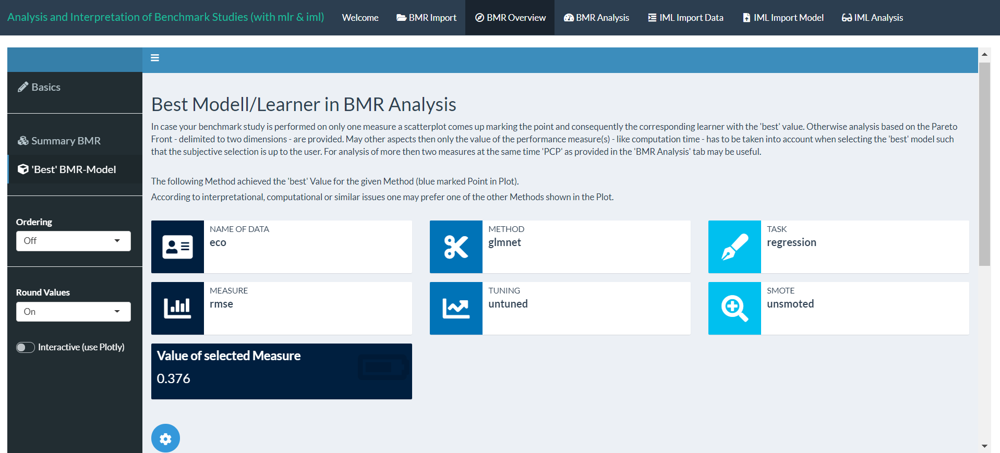
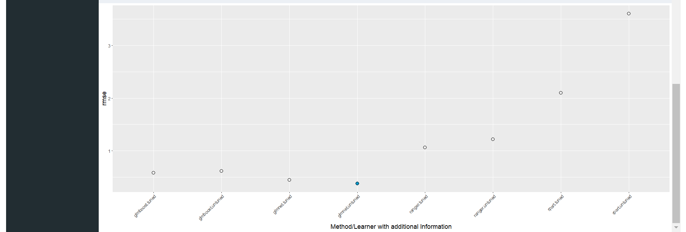

Elsewise, in case the BMR data set contains more then one performance measure a different analysis page will be provided. Routines to select and visualize the maxima for a given strict partial order are shown. This especially includes the computation of the so called Pareto frontier, also known as (Top-k) Skyline operator. These functionalities can be found in the [rPref](https://cran.r-project.org/web/packages/rPref/rPref.pdf) package.

Definition of a Pareto frontier: 'A set of nondominated solutions, being chosen as optimal, if no objective can be improved without sacrificing at least one other objective. On the other hand a solution x* is referred to as dominated by another solution x if, and only if, x is equally good or better than x* with respect to all objectives.'

In this sense Pareto optimal BMR methods are shown in the table and marked by 'Level = 1'. By connecting these points included in the Pareto set the Pareto front gets displayed. One can also select the option 'Skyline Level Plot' displaying all levels of Pareto Fronts based on the top-k Selection. The definition of Pareto fronts itself requires strict dominance in only one dimension, while in the other one the measures could be equally good or better, leading to possibly overlapping front lines. Instead demanding strict dominance in both dimensions will solve this and probably will develop different compositions of the Pareto sets. This different selections can be made with the tab *Choose Type of Plot* on the sidebar. 

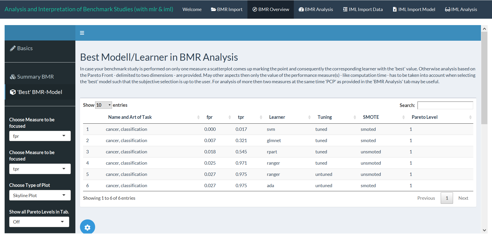
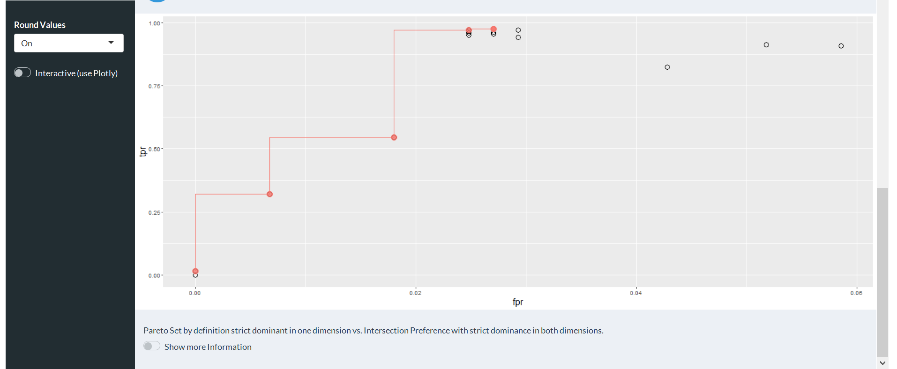
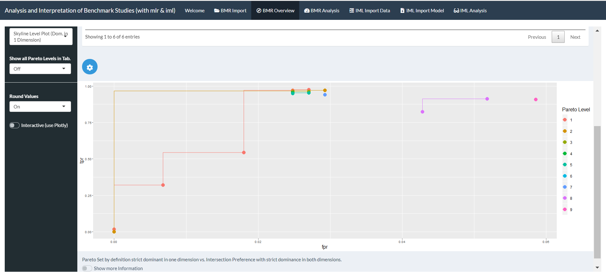

Analyses with help of the Pareto dominance for more than two dimensions are not yet provided. In case of more than two performance measures it may be helpful to make use of the so called Parallel Coordinate Plot (PCP) provided in the next tab.


### 3. Graphical Analysis of the competing Methods included in the Benachmark Study

Having done the analyses so far it is now meaningful to display the results of the benchmark study in form of plots. Doing so you can go to the *BMR Analysis* tab. As a side note it should be mentioned that the settings under the second horizontal line on the sidebar are shown/hidden dependent on the selected type of plot. 

#### Boxplot
For graphical analyses concerning one specific performance measure, which is included in your BMR object, you can make use of the *Boxplot* and *Heatmap* tab on the sidebar. The *Boxplot* tab provides - as the name already indicates - boxplots for a selected measure, which is depending on the user's input at *Choose Measure to be focused*. In order to get the specific plot in return one has to accept the chosen selections by clicking on the tooltip button - as the settings are highly reactive and have to be computed based on the selections. In case one has four different treatments (tuning vs. no tuning; SMOTE vs. no SMOTE) of one aggregated learner there will be boxplots displayed for the performance of each aggregated ML method. Elsewise, the performance per group of learners is only marked by a point on the specific scale of the selected measure. Notice that each group of learners receives an own colour as well as each treatment group (tuning vs. no tuning; SMOTE vs. no SMOTE) is labeled with a characteristic symbol. 

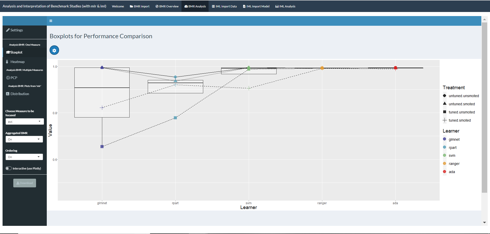

You can go deeper into detail by selecting *Aggregated BMR* as "Off" and thus adding the boxplots containing the values per iteration per treatment group of the respective learning method to the plot. The aggregated results remain in the plot as grey marked points connected by the specific lines marking the treatment group. These lines can be turned off with help of the tooltip. Many more selections can be set up as part of the tooltip, basically concerning the plotting - in particular, changing the colors and zooming in/out of the plot - and label options as well as the collection of the size.

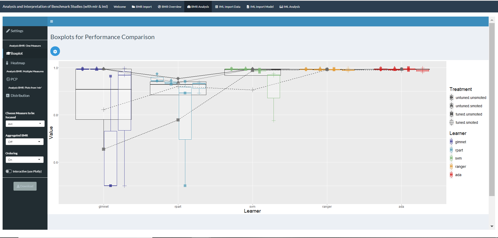

Furthermore, the boxplots can be arrangedy according to their performance rank by *Ordering* the methods going from worst to best respectively left to right of the x-axis. The switch button *Interactive (use Plotly)* provides the created graphic as interactive plot, meaning the plot returns the information available by mouse click on the specific part/point of the plot. This functionality is gained by using the [Plotly](https://plot.ly/r/) package. After having set up your final boxplot selctions the plot can now be downloaded via the *Download* button.

#### Heatmap
Another way of analyzing the BMR object on the basis of one performance measure is provided by the *Heatmap* tab displaying a heatmap with color range of the ML methods marking low and high performance values depending on *Choose Method to be focused*. Therefore, the single learners are grouped on the y-axis and plotted against the respective treatment on the x-axis, so that each cell created this way contains the performance value of this combination of method vs. treatment group. When switching *Aggregated BMR* to "Off" the treatment group and consequently the x-axis gets also split up in the single iterations or - to say it differently - the unaggregated results are shown. In turn *Ordering* rearranges the plot based on the means of aggregated performance per used ML method. Again also an interactive plot becomes available by turning the button *Interactive (use Plotly)* on. In the end, the user defined plot can be downloaded with help of the *Download* button.

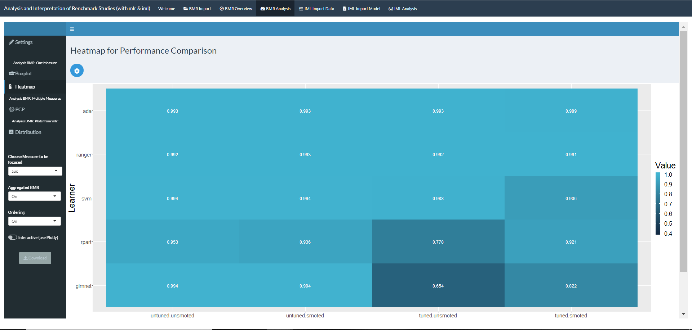
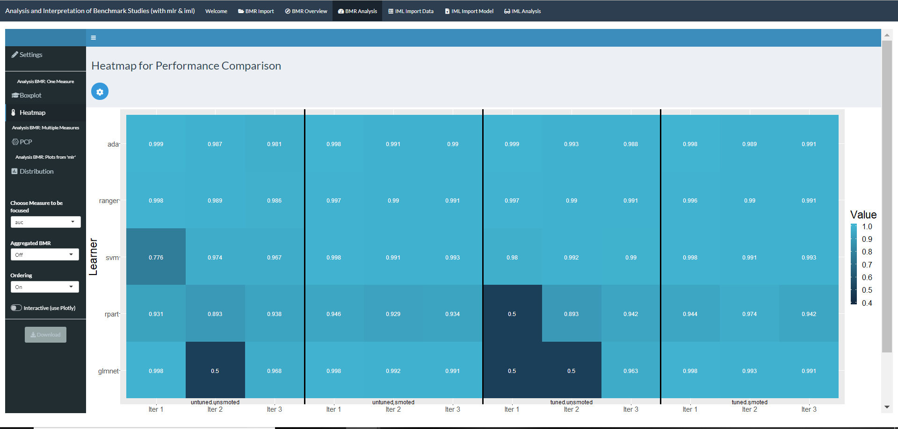

As before, the heatmap is only plotted when the tooltip is chosen in order to confirm the settings. The tooltip provides options that can be particularly used to change colors, labels and the size of the heatmap.

#### PCP
In case that you are generally interested in the learners performance to be compared over all measures included in your BMR object one can rely on the Parallel Coordinates Plot *PCP* for further analyses. This type of visualisation is especially useful for the plotting of multivariate, numerical data - in this case multiple performance measures. Doing so the user gets offered a overview of the relationship between the performance measures, which are achieved by the single ML methods. As reasonable consequence the PCP can only be used for analysis when at least two comparable measures are contained in the BMR object.

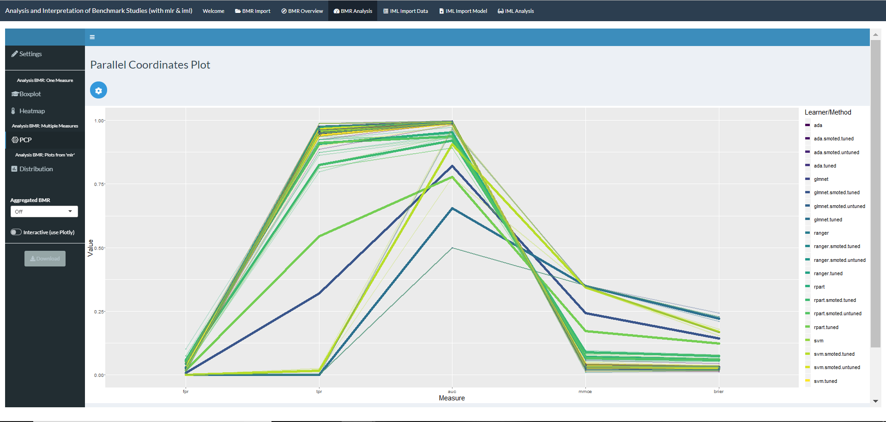

As for the plots mentioned before the options should be set by clicking on the tooltip button. Here some of the plotting options as well as the labels and the size can be controlled. Furthermore, the input of *Aggregated BMR* can be switched "Off" resulting in additional, shadowed lines marking the connection the performance estimates of the single measures grouped by learner per iteration. Also the PCP can be plotted *Interactive (use Plotly)* as well as downloaded via the *Download* button.  

#### Distribution
Beside the so far presented graphical analysis methods, one can also make use of the plots integrated in the **mlr** package. Since most of these plots concentrate on analyzing benchmark studies, which are performed on multiple data sets - what has not been implemented in **shinyBMR** (yet) - and therefore focus on ranks, there is actually only one plot provided, that can be used in case of benchmark studies designed as expected for analyses with **shinyBMR**. 

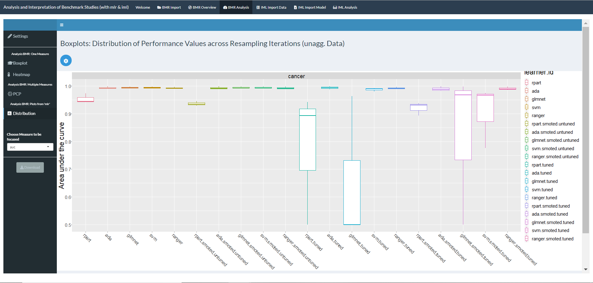

The graphic of **mlr** described plots the distribution of performance values across the resampling iterations and therefore of the unaggregated BMR object. The user can  choose between box- or violin-plots (see tooltip) for the selection of *Choose Method to be focused* input on the sidebar.

## II. Access to the Interpretation of Blackbox ML-Methods (IML)
Having figured out, which ML method to use for your analysis of a specific data set and adjusting the final model you may end up using a blackbox method with high complex or even not tangible interpretation approaches. For these cases the [iml](https://github.com/christophM/iml) package offers an opportunity to explain predictions of these ML methods. **shinyBMR** now also provides the option to use the functionalities of this package graphics in an interactive framework. The steps necessary for receiving the model-agnostic interpretability methods of your focused model are described in the following sections. As a side note it should be mentioned, that one can fit the final model easily with help of the additional package **shinyMlr** provided within the framewok of **mlr**.

### 1. Import and Overview of the focused Data Set 
To get an interpretation approach for your model, you first of all have to provide the data set your model has been trained on. Therefore navigate to the *IML Import Data* tab in the **shinyBMR** app. As starting window the [**Breast Cancer**](https://www.rdocumentation.org/packages/mlbench/versions/2.1-1/topics/BreastCancer) data is displayed as example for a classification task in the sub-tab *Imported Data Set*. As further example one can select a regression task, which is in this case established via the [**Longley's Economic**](https://stat.ethz.ch/R-manual/R-devel/library/datasets/html/longley.html) data and will be provided when the specific alternative is called at *Choose Example Data* on the sidebar. One can upload a data set by choosing the correct *Type* - in this case CSV, Rdata or RDS - of the file and navigating to the corresponding file with help of the *Browse* input tab. As soon as the upload is completed the data table will be displayed. Again, one can spezify *Round Values* on the sidebar for rounding options. 

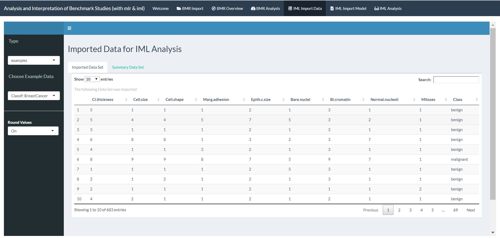

Having uploaded the data set you can now navigate to the sub-tab *Summary Data Set* for getting a summary of all variables included in form of a data table. For each of the variables *name* you get information about the *type* and the sum of missing values *na*. Depending on the type of the variable additionally the *mean*, measure of dispersion *disp*, *median*, *mad*, minimum *min*, maximum *max* and sum of levels *nlevels* are provided. In casee one needs more help in order to understand the summary one can switch the input *Show Information about the Summary Table* below the data table to get additional information. 

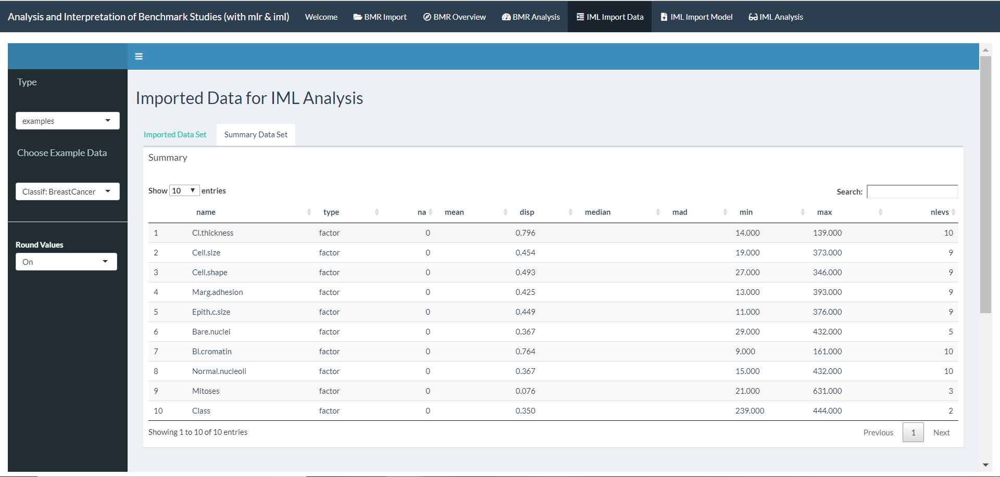
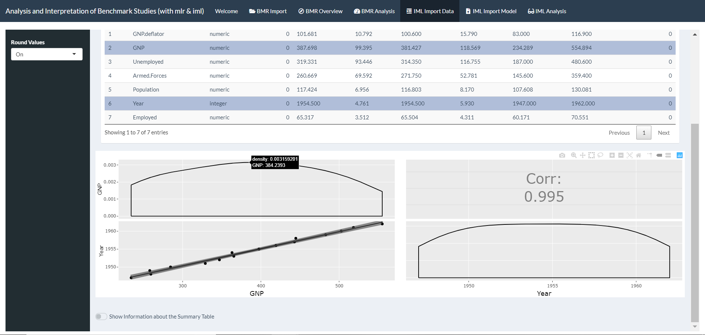

The *Summary Data Set* tab contains even more opportunities for visualizing information of your uploaded data. By selecting one or multiple rows of the summary, plots are displayed right under the data table. The diagnostics show a plot for each variable one by one and of their relationship to each other. Where the actual plot depends on the type of variable respectively the combination of types when more than one row is selected. By default two different ways of comparison of each variable with each can be choosen with the result, that either the *Density* or count of the respective variable *Histogram* along the diagonal is displayed. The plotting options are provided as part of the [GGally](https://cran.r-project.org/web/packages/GGally/GGally.pdf) package extending the [ggplot2](https://cran.r-project.org/web/packages/ggplot2/ggplot2.pdf) package. Note that - as the Breast Cancer data does only contain factor variables - the picture above shows the plotting results, when choosing some of the variables comprised in Longley's Economic example data.

### 2. Import and Overview of the (Blackbox) Model
After your data is transferred to **shinyBMR** one can now upload the model of interest, which has been trained on the specific data set. Therefore navigate to the *IML Import Model* tab. As before, you can either select an example model trained on one of the example data sets - whereby the corresponding data set has to be selected in tab *IML Import Data* - or upload your own model by choosing the format available of the specific model - in this case as RDS or Rdata file - and navigating to this model with help of the *Browse* tab. 

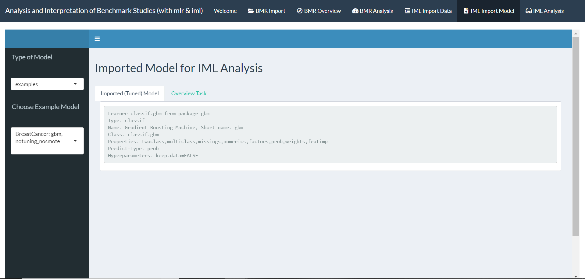

In the sub-tab *Imported (Tuned) Model* some information about the model ypu have uploaded is displayed. As default a model trained on the Breast Cancer data is selected as starting window here. As soon as you have switched between the example models or have chosen your own model the corresponding information will be supplied. 

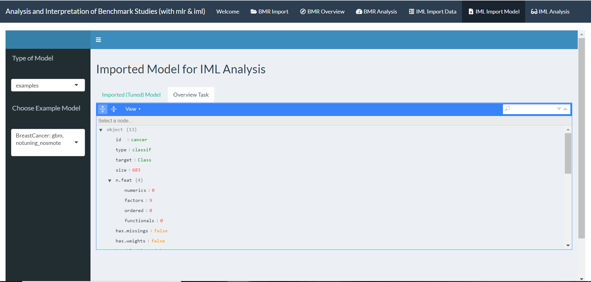

Since the models, which have been trained with help of the **mlr** package, always contain the task they have been trained on, one can have a detailed look on this by navigating to the sub-tab *Overview Task*, where a list with the retrievable information about the task will be shown.

### 3. Access to Interpretability provided by different tools of the **iml** package
Having completed the two steps mentioned before of *IML Import Data* and *IML Import Model* one can now move on to the concrete analysis of the ML method with help of the [**iml**](https://github.com/christophM/iml) package. Before, it might be helpful to go through the [iml book](https://christophm.github.io/book/) for details concering  - which are provided in the framework of this app -  the model-agnostic interpretability methods. A short overview of the implemented iml methods as well as some helpful links are displayed as starting interface when selecting the according tab *IML Analysis* in the header of **shinyBMR**.

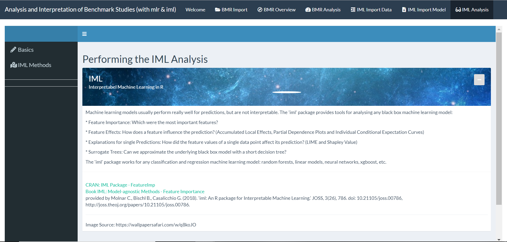

The concrete iml methods are provided when navigating to the *IML Methods* tab, which is located at the sidebar. Selecting this tab will lead to a new window with additional options in the sidebar. First of all, you have to *Select IML-Method* that you are interested in. One of the following iml methods can be chosen:
* Feature Importance
* Feature Effects
  - Partial dependence plots (PDP)
  - Individual conditional expectation plots (ICE)
  - Accumulated local effects (ALE)
* Feature Interaction
* Local Model: Local Interpretable Model-agnostic Explanations (LIME)
* Shapley Values (for explaining single predictions)
* Tree Surrogate

As these iml methods are somehow depending on coincidence, it is recommended to *Set Seed* at the sidebar tab to get reproducible results. Per default this seed is set to *123*. Some of the iml methods require necessary selections like the instance or variable of interest. In this case the demanded input is directly shown in the plotting window under the tooltip depending on the selection in the *Select IML-Method* tab. The tooltip is also individually reacting to your chosen iml method and contains additional options for the corresponding iml analysis tools as well as information about the settings selectable. To confirm your settings and finally plotting the iml methods you have to click on the *Set Selections* button. Every time you make a change in any selection of your settings, these have to be newly set by clicking on the *Set Selections* button again and thereby recalculating the specific results of the iml method.

While calculation is performed a spinner shows up in the plotting window and will be replaced by the corresponding plot as soon as computations have been finalised. There is one sub-tab in the plotting frame selectable to show the actual *IML Plot*. Besides this, one can navigate towards the sub-tab *IML Results* to display the calculation results the plot is based on. 

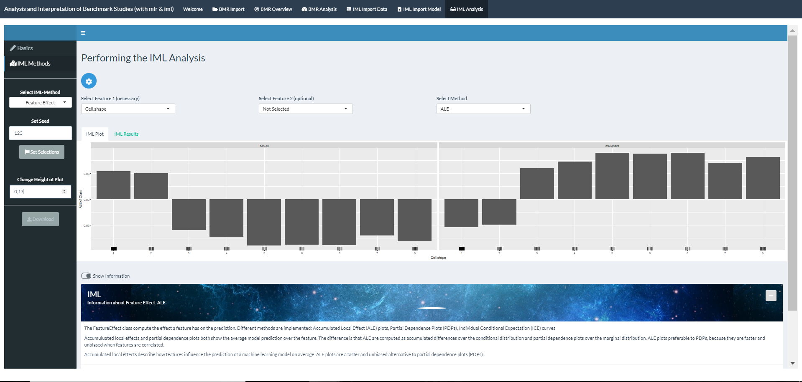

The sidebar of *IML Methods* also provides a selection panel for setting the height of the iml plots. Additionally one can download the latest plot by clicking the *Download* button and choosing the directory as well as the file name for the plot to be saved. Furthermore there is a slider in the plotting window to *Show Information* about the selected iml method. Here you can also use the links provided to navigate towards the corresponding chapters in the [iml book](https://christophm.github.io/book/) such as to the according CRAN side holding the specific R function.
